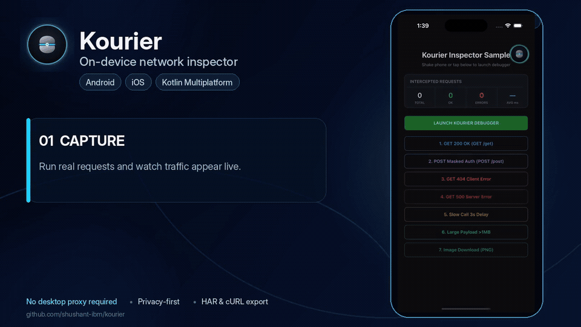

# Kourier 🚀

[](https://github.com/dev-shushant/kourier)
[](https://kotlinlang.org)
[](https://www.jetbrains.com/lp/compose-multiplatform/)
[](https://swift.org/package-manager/)
[](https://raw.githubusercontent.com/dev-shushant/kourier/mvn-repo)
[](https://github.com/dev-shushant/kourier/releases)
[](https://github.com/dev-shushant/kourier/stargazers)
[](LICENSE)

## Inspect Android & iOS network traffic directly on the device

**Kourier is an on-device HTTP/HTTPS network inspector for Android and iOS, built with Kotlin Multiplatform and Compose Multiplatform.**

Capture requests and responses, inspect failures, analyze timings, mask sensitive data, and export diagnostics as **HAR, cURL, plain text, or detailed reports** — directly from the device where the issue happened.


<p align="center">
  <strong>Capture · Inspect · Debug · Share</strong><br/>
  Android + iOS · Kotlin Multiplatform · Compose Multiplatform
</p>

## See Kourier in Action

<p align="center">
  
</p>

<p align="center">
  <strong>Capture → Inspect → Debug → Share — directly on the device.</strong>
</p>

> Built for mobile developers and QA teams who need the exact network context from the device where an issue was reproduced.

- **Distribution repository:** https://github.com/dev-shushant/kourier
- **Source repository:** https://github.com/dev-shushant/kourier-kmp
- **Current release:** `0.0.1`

---

## Why Kourier?

A mobile API issue is often reported like this:

> "The API failed on my device."

But the useful debugging questions are much more specific:

- What request actually left the device?
- Which headers and payload were sent?
- What came back from the server?
- Was the failure caused by HTTP, transport, authentication, or timing?
- Which part of the application triggered the request?
- How can QA share the exact transaction with engineering?
- Can the issue be reproduced without getting access to the original device?

Kourier keeps that debugging loop on-device.

Instead of requiring the person reproducing the issue to set up a separate desktop debugging environment, Kourier captures traffic at the application's networking layer and exposes it directly inside the app.

### At a glance

| Capability | What Kourier provides |
| :--- | :--- |
| **On-device inspection** | Inspect requests, responses, headers, payloads, timings, errors, and protocol metadata |
| **Android + iOS** | A shared inspection experience across both mobile platforms |
| **Native interception** | OkHttp / Retrofit / Ktor on Android and URLSession-based interception on iOS |
| **Fast access** | Floating bubble, notification tray, shake gesture, or programmatic presentation |
| **Live telemetry** | Observe total requests, active requests, errors, and recent network activity |
| **Privacy controls** | Recursive JSON masking, header redaction, query redaction, and payload truncation |
| **Export** | Plain text, diagnostic `.txt`, HAR 1.2, and executable cURL |
| **Bounded persistence** | SQLDelight-backed SQLite storage with count- and age-based retention |
| **Release separation** | `kourier-noop` Android artifact for builds where inspection should not be active |

---

# Quick Start

## Android

### 1. Add the public Maven repository

Add Kourier's public Maven repository to `settings.gradle.kts`:

```kotlin
dependencyResolutionManagement {
    repositories {
        google()
        mavenCentral()

        maven {
            url = uri(
                "https://raw.githubusercontent.com/dev-shushant/kourier/mvn-repo"
            )
        }
    }
}
```

No GitHub token, Personal Access Token, or authentication is required.

---

### 2. Add Kourier

```kotlin
dependencies {

    // Development / debug builds
    debugImplementation(
        "dev.shushant.kourier:kourier-android:0.0.3"
    )

    // Release builds
    releaseImplementation(
        "dev.shushant.kourier:kourier-noop:0.0.3"
    )
}
```

The full inspector is included in debug builds, while release builds can use the API-compatible no-op implementation.

---

### 3. Initialize Kourier

```kotlin
import android.app.Application
import dev.shushant.kourier.android.Kourier
import dev.shushant.kourier.android.TriggerStyle

class MyApplication : Application() {

    override fun onCreate() {
        super.onCreate()

        Kourier.init(this) {

            // Maximum body captured per request / response
            maxPayloadSize(500 * 1024L)

            // Local transaction retention
            maxRetentionCount(1000)
            retentionPeriodDays(3)

            // Sensitive data protection
            redactHeaders(
                "Authorization",
                "Cookie",
                "X-Api-Key",
                "X-Session-Token"
            )

            redactPayloadKeys(
                "password",
                "token",
                "secret",
                "credit_card",
                "ssn",
                "cvv"
            )

            redactQueryParams(
                "token",
                "apiKey",
                "secret"
            )

            // Bubble + notification tray
            triggerStyle(TriggerStyle.BOTH)

            // Optional request-origin tracing
            captureCallStack(
                true,
                maxDepth = 15
            )
        }
    }
}
```

---

### 4. Attach Kourier to your network client

### OkHttp / Retrofit

```kotlin
import dev.shushant.kourier.interceptor.okhttp.KourierOkHttpInterceptor
import okhttp3.OkHttpClient

val client = OkHttpClient.Builder()
    .addInterceptor(
        KourierOkHttpInterceptor()
    )
    .build()
```

Retrofit applications using this `OkHttpClient` are automatically captured.

---

### Ktor Client 3.x

```kotlin
import dev.shushant.kourier.interceptor.ktor.KourierKtorPlugin
import io.ktor.client.HttpClient
import io.ktor.client.engine.okhttp.OkHttp

val client = HttpClient(OkHttp) {
    install(KourierKtorPlugin)
}
```

---

### Android 13+ notification permission

If you enable Kourier's notification-based telemetry, Android 13+ requires runtime notification permission:

```kotlin
if (Build.VERSION.SDK_INT >= Build.VERSION_CODES.TIRAMISU) {

    requestPermissions(
        arrayOf(
            Manifest.permission.POST_NOTIFICATIONS
        ),
        REQUEST_CODE
    )
}
```

---

# iOS

Kourier is distributed through **Swift Package Manager** as a precompiled XCFramework.

The current package supports **iOS 15+**.

---

### 1. Add Kourier through Swift Package Manager

In Xcode:

**File → Add Package Dependencies...**

Enter:

```text
https://github.com/dev-shushant/kourier.git
```

Select version `0.0.1` or an appropriate compatible version rule.

Add the `KourierIos` package product to your application target.

Or declare it in `Package.swift`:

```swift
dependencies: [

    .package(
        url: "https://github.com/dev-shushant/kourier.git",
        from: "0.0.3"
    )
]
```

---

### 2. Initialize Kourier

```swift
import KourierIos

Kourier.shared.doInit { builder in

    builder.maxPayloadSize(
        bytes: 500 * 1024
    )

    builder.maxRetentionCount(
        count: 1000
    )

    builder.retentionPeriodDays(
        days: 3
    )

    builder.triggerStyle(
        style: .both
    )

    builder.captureCallStack(
        enable: true,
        maxDepth: 15
    )
}
```

---

### 3. Install URLSession interception

```swift
KourierURLSessionConfiguration.shared.install()
```

For applications using custom `URLSessionConfiguration` instances:

```swift
let configuration =
    URLSessionConfiguration.default

KourierURLSessionConfiguration.shared.enable(
    configuration: configuration
)

let session =
    URLSession(
        configuration: configuration
    )
```

This is useful when networking libraries or internal network layers manage their own session configuration.

---

### 4. Required Info.plist configuration

Add:

```xml
<key>CADisableMinimumFrameDurationOnPhone</key>
<true/>
```

---

### Swift helper for redaction arrays

Kotlin varargs bridge to Swift as `KotlinArray<NSString>`.

A small helper makes configuration easier:

```swift
func kotlinArray(
    _ strings: String...
) -> KotlinArray<NSString> {

    KotlinArray(
        size: Int32(strings.count)
    ) { index in

        strings[
            Int(
                truncating: index
            )
        ] as NSString
    }
}
```

You can then configure redaction:

```swift
Kourier.shared.doInit { builder in

    builder.redactHeaders(
        headers: kotlinArray(
            "Authorization",
            "Cookie",
            "X-Api-Key"
        )
    )

    builder.redactPayloadKeys(
        keys: kotlinArray(
            "password",
            "token",
            "secret",
            "credit_card"
        )
    )

    builder.redactQueryParams(
        params: kotlinArray(
            "token",
            "apiKey",
            "secret"
        )
    )
}
```

---

# Architecture

Kourier follows one core architectural principle:

> **Intercept natively. Normalize centrally. Inspect uniformly.**

```text
                           Host Application
                                  │
                           HTTP / HTTPS traffic
                                  │
             ┌────────────────────┴────────────────────┐
             │                                         │
          Android                                     iOS
             │                                         │
    OkHttp / Retrofit / Ktor                  URLSession-based clients
             │                                         │
             ▼                                         ▼
     Kourier Interceptors                     Kourier URL Interception
             │                                         │
             └────────────────────┬────────────────────┘
                                  │
                                  ▼
                         ┌──────────────────┐
                         │   KourierCore    │
                         │ Shared KMP Model │
                         └────────┬─────────┘
                                  │
                 ┌────────────────┼────────────────┐
                 │                │                │
                 ▼                ▼                ▼
             Redaction        Event Flow       SQLDelight
             & Limits         Telemetry         Storage
                 │                │                │
                 └────────────────┼────────────────┘
                                  │
                                  ▼
                      Compose Multiplatform
                         Inspector UI
                                  │
                     ┌────────────┼────────────┐
                     │            │            │
                     ▼            ▼            ▼
                   Text         HAR 1.2       cURL
```

The key idea is that **network interception remains platform appropriate**, while telemetry becomes platform independent after capture.

Kourier does not attempt to replace the host application's networking architecture.

The host application continues to own:

- authentication
- retries
- caching
- SSL / certificate policies
- request serialization
- response decoding
- dependency injection
- network-client lifecycle

Kourier observes the request lifecycle and converts captured traffic into a shared model.

That shared model powers:

- inspection
- filtering
- telemetry
- privacy masking
- persistence
- export
- adaptive UI

across Android and iOS.

---

# Core Capabilities

## On-device transaction inspection

Each captured request can expose information such as:

- URL
- host
- HTTP method
- status code
- request headers
- response headers
- query parameters
- request body
- response body
- content type
- content length
- transaction state
- transport errors
- timing information
- protocol information
- TLS metadata where available
- total bytes sent
- total bytes received
- optional call-stack information

The inspector supports search and filtering to make large traffic sessions easier to navigate.

---

# Floating Bubble

Kourier can expose a draggable floating bubble while the host application is being used.

This allows developers and QA engineers to open the inspector immediately without navigating through a separate developer settings screen.

The bubble can also display error state information so failed requests are visible while testing.

When the Kourier inspector is presented, the overlay lifecycle is managed so the bubble does not interfere with the inspector UI.

---

# Trigger Styles

Applications can choose how Kourier is surfaced:

```kotlin
enum class TriggerStyle {

    NOTIFICATION_TRAY,

    FLOATING_BUBBLE,

    BOTH,

    SHAKE_ONLY
}
```

| Trigger | Recommended use |
| :--- | :--- |
| `FLOATING_BUBBLE` | Fast access during active development |
| `NOTIFICATION_TRAY` | QA/internal builds where the product UI should stay unobstructed |
| `BOTH` | Maximum visibility while testing |
| `SHAKE_ONLY` | Minimal on-screen presence |

---

## Programmatic presentation

### Android

```kotlin
Kourier.showUI()
Kourier.hideUI()
```

### iOS

```swift
Kourier.shared.showUI()
Kourier.shared.hideUI()
```

iOS trigger mode can also be switched dynamically:

```swift
Kourier.shared.switchToBubble()

Kourier.shared.switchToNotificationTray()

Kourier.shared.switchToBoth()
```

---

# Live Network Telemetry

Kourier can expose network activity without requiring the inspector to remain open.

Live telemetry can include:

```text
Total requests
Active requests
Errors
Recent status codes
Traffic activity
```

Normal traffic can remain ambient.

Failures such as:

```text
4xx
5xx
Timeout
Transport failure
```

can be surfaced more prominently so the developer knows something went wrong immediately.

Kourier uses an updating telemetry surface instead of generating a new notification for every HTTP request.

---

# Live Telemetry API

## Android

```kotlin
import dev.shushant.kourier.android.KourierTelemetry
import dev.shushant.kourier.android.KourierStats

val stats: KourierStats by
    KourierTelemetry
        .stats
        .collectAsState()

Text(
    "Total: ${stats.totalRequests}, " +
        "Active: ${stats.activeRequests}, " +
        "Errors: ${stats.errorCount}"
)
```

---

## iOS

```swift
let unsubscribe =
    Kourier.shared.observeStats {
        total,
        active,
        errors in

        print(
            "Traffic: \(total) total, " +
            "\(active) active, " +
            "\(errors) errors"
        )
    }

// Stop observing when no longer needed.
unsubscribe()
```

---

# Privacy-First Redaction

Network traffic can contain highly sensitive information.

Examples include:

```text
Authorization tokens
Session cookies
API keys
Passwords
Refresh tokens
User identifiers
Payment-related data
```

Kourier provides configurable redaction before diagnostic information is persisted.

---

## Header redaction

Common sensitive headers include:

```text
Authorization
Cookie
Set-Cookie
Proxy-Authorization
X-Auth-Token
X-Api-Key
```

Example:

```text
Authorization: Bearer eyJ...
```

becomes:

```text
Authorization: ••••••••
```

---

## Query parameter redaction

Common query parameters include:

```text
token
access_token
apiKey
secret
password
```

---

## Recursive JSON redaction

Sensitive keys can exist deep inside nested payloads.

For example:

```json
{
  "user": {
    "credentials": {
      "access_token": "secret-value"
    }
  }
}
```

Kourier can persist the masked representation:

```json
{
  "user": {
    "credentials": {
      "access_token": "••••••••"
    }
  }
}
```

Arrays and nested child objects are traversed recursively.

Common fields include:

```text
password
token
access_token
refresh_token
secret
client_secret
ssn
credit_card
card_number
cvv
pin
```

> Applications should extend the redaction configuration with fields specific to their own data model.

---

# Bounded Payload Capture

A debugging tool should not blindly retain unlimited response bodies.

A network response may contain:

- a small JSON document
- a large image
- a multi-megabyte API response
- downloadable content
- binary files

Kourier therefore supports configurable body limits:

```kotlin
maxPayloadSize(
    500 * 1024L
)
```

When a captured payload exceeds the configured threshold, Kourier truncates the stored representation instead of retaining the complete body.

---

# Bounded Local Storage

Kourier uses SQLDelight-backed SQLite persistence for captured transactions.

Retention can be controlled by both transaction count and age:

```kotlin
maxRetentionCount(
    1000
)

retentionPeriodDays(
    3
)
```

This ensures debugging history remains useful without becoming unlimited application storage.

Stored network traffic can also be cleared directly from the inspector.

---

# Call-Site Tracing

An endpoint alone does not always tell you which feature generated the request.

For example, the same API might be called from:

```text
Home
Profile
Booking
Background refresh
Authentication retry
```

Kourier can optionally capture the request-origin call stack:

```kotlin
captureCallStack(
    true,
    maxDepth = 15
)
```

This helps connect network behavior back to application code.

---

# Adaptive Compose Multiplatform UI

Kourier uses Compose Multiplatform for the inspector experience.

On smaller screens, network transactions use a focused navigation flow.

On larger devices such as tablets and iPads, the interface can adapt into a master-detail layout.

This allows the same inspection experience to scale across:

```text
Android phones
Android tablets
Foldables
iPhones
iPads
```

while sharing the majority of the UI implementation.

---

# Export and Sharing

Debugging often continues outside the device.

Kourier supports multiple formats because each one serves a different workflow.

---

## Plain Text

Useful for:

```text
Slack
Teams
WhatsApp
Telegram
Issue trackers
Notes
```

Example:

```text
[Kourier] 500 POST https://api.example.com/checkout

Duration: 420 ms
Size: 1.2 KB

Error:
Internal Server Error
```

---

## Diagnostic `.txt`

A detailed text report can include:

```text
Request URL
HTTP method
Request headers
Request body
Response headers
Response body
Timings
Errors
Call stack
Protocol metadata
```

---

## HAR 1.2

Kourier can export HTTP Archive files.

This allows captured mobile traffic to be moved into HAR-compatible desktop tooling for deeper analysis.

The flow can become:

```text
QA reproduces issue
        ↓
Kourier captures traffic
        ↓
Export HAR
        ↓
Engineer investigates on desktop
```

---

## Executable cURL

Individual requests can also be represented as cURL:

```bash
curl 'https://api.example.com/checkout' \
  -X POST \
  -H 'Content-Type: application/json' \
  --data '{"orderId":"12345"}'
```

This makes it easier to reproduce a mobile request independently from the application.

Sensitive values remain subject to the configured redaction rules.

---

# Kotlin Multiplatform Setup

For KMP applications sharing their networking layer through `commonMain`:

```kotlin
import dev.shushant.kourier.interceptor.ktor.KourierKtorPlugin
import io.ktor.client.HttpClient

val sharedHttpClient =
    HttpClient {

        install(
            KourierKtorPlugin
        )
    }
```

The network client can remain shared while platform integrations handle the surrounding inspector experience.

---

# Platform Support

| Platform | Minimum | Networking Integration | Inspector UI |
| :--- | :--- | :--- | :--- |
| **Android** | Android 7.0 / API 24+ | OkHttp 4.x/5.x, Retrofit, Ktor Client 3.x | Compose Multiplatform |
| **iOS** | iOS 15+ | URLSession and URLSessionConfiguration-based clients | Compose Multiplatform hosted through UIKit |

Physical devices and simulators/emulators are supported by the distributed platform binaries.

---

# Configuration Reference

| Method | Type | Default | Purpose |
| :--- | :--- | :--- | :--- |
| `triggerStyle(style)` | `TriggerStyle` | `BOTH` | Select bubble, notification, both, or shake-only |
| `maxPayloadSize(bytes)` | `Long / Int` | `250 KB` | Maximum stored request/response body size |
| `maxRetentionCount(count)` | `Int` | `1000` | Maximum retained transactions |
| `retentionPeriodDays(days)` | `Int` | `3` | Maximum transaction retention age |
| `redactHeaders(...)` | `vararg String` | Common auth headers | Mask selected HTTP header values |
| `redactPayloadKeys(...)` | `vararg String` | Common secret fields | Recursively mask JSON keys |
| `redactQueryParams(...)` | `vararg String` | Common token fields | Mask URL query values |
| `captureCallStack(enable, depth)` | `Boolean, Int` | `true, 15` | Capture request origin |
| `darkTheme(value)` | `Boolean?` | `null` | Force dark/light or follow host appearance |
| `enableShakeGesture(enable)` | `Boolean` | `true` | Enable shake-to-open |
| `enableFloatingBubble(enable)` | `Boolean` | `true` | Enable floating trigger |
| `enableNotification(enable)` | `Boolean` | `true` | Enable notification telemetry |

---

# Core Transaction Model

Internally, captured traffic is normalized into a shared representation similar to:

```kotlin
data class HttpTransaction(

    val id: String,

    val timestamp: Long,

    val request: HttpRequest,

    val response: HttpResponse?,

    val error: ErrorPayload?,

    val status: TransactionStatus,

    val timings: HttpTimings,

    val callStack:
        List<CallStackElement>,

    val protocol: String?,

    val tlsVersion: String?,

    val totalBytesSent: Long,

    val totalBytesReceived: Long
)
```

This shared model is what allows Android and iOS traffic to use the same downstream telemetry, persistence, filtering, masking, and inspection logic.

---

# Android Release Builds: `kourier-noop`

Network inspection tooling should not actively capture application traffic in production builds.

Kourier provides an API-compatible Android no-op artifact:

```kotlin
dependencies {

    debugImplementation(
        "dev.shushant.kourier:kourier-android:0.0.3"
    )

    releaseImplementation(
        "dev.shushant.kourier:kourier-noop:0.0.3"
    )
}
```

With the no-op implementation selected:

- interceptors pass requests through without recording payloads
- Kourier initialization does not start the inspector
- local inspection storage is not initialized
- notification telemetry is not started
- application call sites can remain unchanged

This allows build-time separation without scattering checks like:

```kotlin
if (BuildConfig.DEBUG) {
    // ...
}
```

throughout the host application.

For iOS, Kourier should similarly be treated as development/internal tooling and included according to the application's target and distribution strategy.

---

# Roadmap

Kourier's current foundation focuses on:

```text
Capture
Inspection
Privacy
Persistence
Sharing
Cross-platform developer experience
```

The next stage is to make the telemetry itself more useful.

## Available today

- [x] Android OkHttp / Retrofit interception
- [x] Ktor Client 3.x integration
- [x] iOS URLSession-based interception
- [x] Shared Kotlin Multiplatform transaction model
- [x] Compose Multiplatform inspector
- [x] Floating bubble
- [x] Notification-based telemetry
- [x] Shake trigger
- [x] Request / response inspection
- [x] Search and filtering
- [x] Recursive sensitive-data redaction
- [x] Payload truncation
- [x] Bounded SQLDelight persistence
- [x] Call-site tracing
- [x] Plain-text export
- [x] Diagnostic report export
- [x] HAR 1.2 export
- [x] cURL export
- [x] Android `kourier-noop` artifact

---

## Exploring next: Kourier Insights

The goal is not to add AI simply for the sake of it.

The next intelligence layer should help answer:

> **What looks wrong about this traffic?**

Potential capabilities:

- [ ] Duplicate-request detection
- [ ] Slow-endpoint detection
- [ ] Latency anomaly insights
- [ ] Retry storm detection
- [ ] Authentication-loop detection
- [ ] OpenAPI contract validation
- [ ] Response schema drift detection
- [ ] Related-request correlation
- [ ] Session health summary
- [ ] Failure-chain analysis
- [ ] Locally generated diagnostic hints
- [ ] Optional privacy-safe AI-assisted debugging

For example:

```text
POST /booking
12:01:34.218

POST /booking
12:01:34.511

Time difference: 293 ms

Possible duplicate request detected.
```

Or:

```text
GET /api/profile

Current latency: 2.8 s
Recent median:   480 ms

Most time spent waiting for server response.
```

The aim is to evolve Kourier from:

> **What happened?**

toward:

> **What happened, what looks unusual, and where should I investigate next?**

Have a debugging scenario you think Kourier should detect?

[Open an issue](https://github.com/dev-shushant/kourier/issues) and describe the problem.

---

# Engineering Deep Dive

Want to understand the architecture and design decisions behind Kourier?

I wrote a detailed engineering article covering:

- why Kourier was built
- Android and iOS interception strategy
- Kotlin Multiplatform architecture
- shared telemetry design
- Compose Multiplatform UI
- privacy and redaction
- bounded storage
- HAR and cURL export
- release separation
- lessons from building a reusable cross-platform SDK

### Read the Medium article

[**Building Kourier: An Enterprise-Grade On-Device Network Inspector for Android & iOS with Kotlin Multiplatform**](https://medium.com/@shushanttiwari.ashu/building-kourier-an-enterprise-grade-on-device-network-inspector-for-android-ios-with-kotlin-51a58254197a)

---

# Troubleshooting

## Android notification is not visible

On Android 13+ / API 33+, make sure the host application requests:

```text
android.permission.POST_NOTIFICATIONS
```

at runtime when notification-based telemetry is enabled.

---

## iOS frame pacing / startup issue

Ensure the host application's `Info.plist` contains:

```xml
<key>CADisableMinimumFrameDurationOnPhone</key>
<true/>
```

---

## iOS linker errors involving SQLite or libc++

When integrating manually, ensure the application target links:

```text
libsqlite3.tbd
libc++.tbd
```

The Swift Package Manager package declares these linker requirements for its Swift wrapper target.

---

# Contributing

Kourier is actively evolving.

Contributions and feedback are welcome, especially around:

- Android networking compatibility
- iOS networking compatibility
- Kotlin Multiplatform integration
- bug reproduction
- performance
- privacy
- export formats
- QA workflows
- documentation
- developer experience

Useful ways to contribute:

- report reproducible bugs
- propose features
- improve documentation
- test Kourier with different networking stacks
- suggest real-world debugging scenarios
- contribute implementation improvements

### Links

- [Report a bug or request a feature](https://github.com/dev-shushant/kourier/issues)
- [Browse releases](https://github.com/dev-shushant/kourier/releases)
- [Explore the source repository](https://github.com/dev-shushant/kourier-kmp)

If Kourier saves you debugging time, consider **starring the repository** ⭐

It helps other Android, iOS, and Kotlin Multiplatform developers discover the project.

---

# License

```text
Copyright 2026 Shushant Tiwari

Licensed under the Apache License, Version 2.0
(the "License");

you may not use this file except in compliance
with the License.

You may obtain a copy of the License at:

http://www.apache.org/licenses/LICENSE-2.0

Unless required by applicable law or agreed to
in writing, software distributed under the License
is distributed on an "AS IS" BASIS,

WITHOUT WARRANTIES OR CONDITIONS OF ANY KIND,
either express or implied.

See the License for the specific language governing
permissions and limitations under the License.
```

---

<p align="center">
  <strong>Kourier</strong><br/>
  On-device network inspection for Android & iOS
</p>

<p align="center">
  Built with Kotlin Multiplatform · Compose Multiplatform · SQLDelight
</p>
